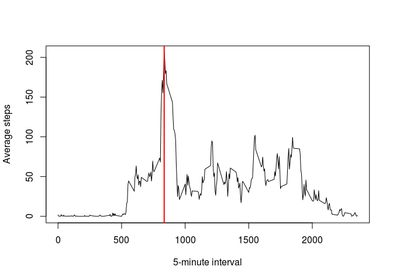

# Reproducible Research: Peer Assessment 1

## Loading and preprocessing the data

```r
#setwd("~/GitHub/RepData_PeerAssessment1")
#unzip("activity.zip")
act_df <- read.csv("activity.csv")
```

## What is mean total number of steps taken per day?

```r
steps_by_date <- sapply(split(act_df, act_df$date), function(x) {sum(na.omit(x$steps))})
hist(steps_by_date, breaks = 16, xlab = "Total steps per day", col = "green", main = "")
```

 

```r
mean(steps_by_date)
```

```
## [1] 9354.23
```

```r
median(steps_by_date)
```

```
## [1] 10395
```

## What is the average daily activity pattern?

```r
steps_by_interval <- sapply(split(act_df, act_df$interval), function(x) {mean(na.omit(x$steps))})
plot(as.numeric(names(steps_by_interval)), steps_by_interval, type = "l", xlab = "5-minute interval", ylab = "Average steps")
max_interval <- names(which.max(steps_by_interval))
max_interval
```

```
## [1] "835"
```

```r
abline(v = as.numeric(max_interval), col = "red", lwd = 2)
```

 

## Imputing missing values
Strategy: replace each missing value with the mean for that interval...

```r
na_rows <- is.na(act_df$steps)
sum(na_rows)
```

```
## [1] 2304
```

```r
# for each NA row, put in the mean for that interval
imputed_df <- act_df
imputed_df$steps[na_rows] <- rep_len(as.vector(steps_by_interval), length(na_rows))[na_rows]
imputed_steps_by_date <- sapply(split(imputed_df, imputed_df$date), function(x) {sum(na.omit(x$steps))})
par(mfrow = c(1, 2))
hist(steps_by_date, breaks = 16, xlab = "Total steps per day", col = "green", main = "Before Imputing")
hist(imputed_steps_by_date, breaks = 16, xlab = "Total steps per day", col = "green", main = "After Imputing")
```

 

```r
mean(imputed_steps_by_date)
```

```
## [1] 10766.19
```

```r
median(imputed_steps_by_date)
```

```
## [1] 10766.19
```

## Are there differences in activity patterns between weekdays and weekends?

```r
if (!require(lubridate)) {
  install.packages("lubridate")
  library(lubridate)
}
```

```
## Loading required package: lubridate
```

```r
if (!require(reshape2)) {
  install.packages("reshape2")
  library(reshape2)
}
```

```
## Loading required package: reshape2
```

```r
imputed_df$day_type <- as.factor(sapply(weekdays(ymd(imputed_df$date), abbreviate = T), 
                                        function(x) {if (x %in% c("Sat", "Sun")) "weekend" else "weekday"}))
# split weekdays from weekends
tmp <- split(imputed_df, imputed_df$day_type)
# calculate means
tmp$weekday <- sapply(split(tmp$weekday, tmp$weekday$interval), function(x) {mean(na.omit(x$steps))})
tmp$weekend <- sapply(split(tmp$weekend, tmp$weekend$interval), function(x) {mean(na.omit(x$steps))})
# put back into one data frame
tmp <- data.frame(tmp)
tmp$interval <- row.names(tmp)
tmp <- melt(tmp, id.vars = c("interval"))
names(tmp) <- c("interval", "day_type", "steps")
tmp$interval <- as.numeric(tmp$interval)
# panel plot
library(lattice)
xyplot(steps ~ interval | day_type, data = tmp, layout = c(1, 2), type = "l")
```

 
